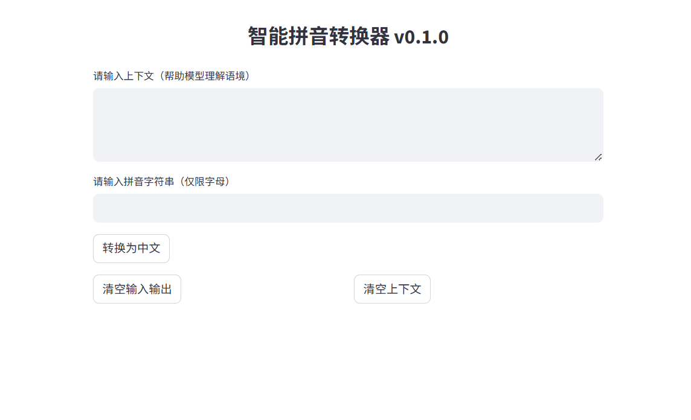

# LLMPinyinConverter - 智能拼音转汉字系统 🚀

> 使用大语言模型（LLM）将无空格拼音字符串智能转换为上下文相关的中文句子。

---

## 🔍 功能亮点

- ✨ 利用 LLM 精确切分拼音片段
- ✨ 自动处理多音字（如“hang”、“xing”）
- ✨ 上下文记忆功能提升语义一致性
- ✨ 提供可视化界面（Streamlit）

---

## 🧰 技术栈

- Python 3.8+
- Transformers + PyTorch
- Streamlit（前端界面）
- 支持本地模型加载（如 Qwen）

---

## 🚀 快速开始

### 安装依赖

```bash
pip install -r requirements.txt
```

### 运行应用

```bash
streamlit run app.py
```

---

## 🖼️ 示例展示



---


MIT License  
Copyright (c) 2025 YourName
```

---
